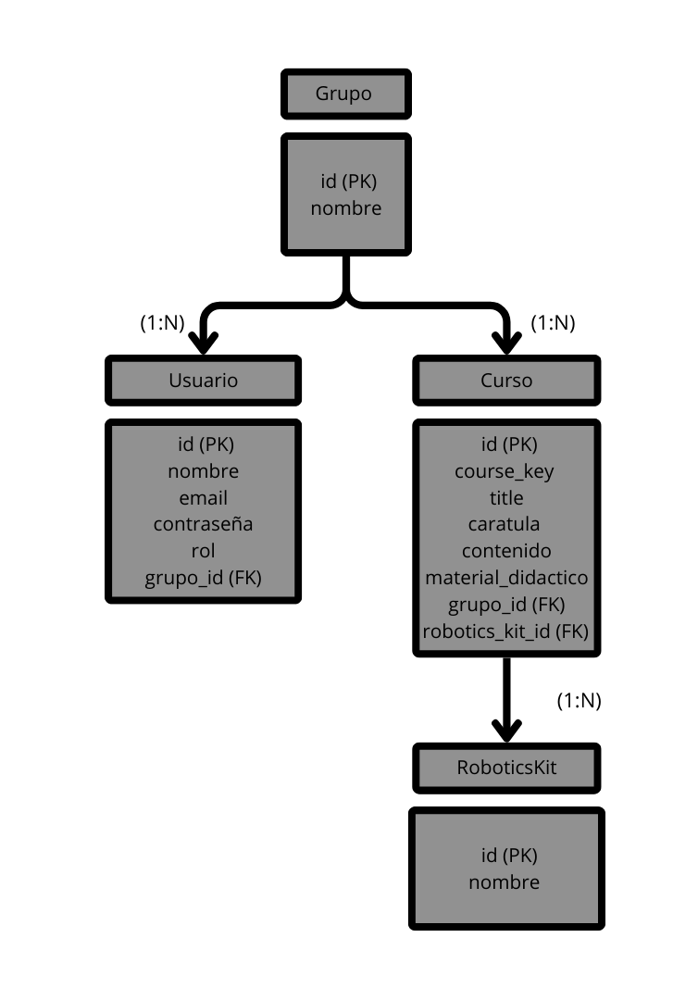

# Sistema de Gestión para Escuela de Robótica 🚀

## Descripción  
Plataforma de gestión académica desarrollada para administrar grupos, cursos, usuarios y kits de robótica en una escuela especializada.  
**Funcionalidades principales**:  
- Registro de usuarios con roles (estudiante, docente, administrativo).  
- Asignación de cursos a grupos.  
- Gestión de kits de robótica vinculados a cursos.  

## Diagrama ER  
  

## Requisitos  
- MySQL 8.0+ (para importar la base de datos).  
- Navegador web (para visualizar la documentación).  

## Instalación  
1. **Clona el repositorio**:  
   ```bash
   git clone https://github.com/Mapka21/ACTIVIDAD7.git
